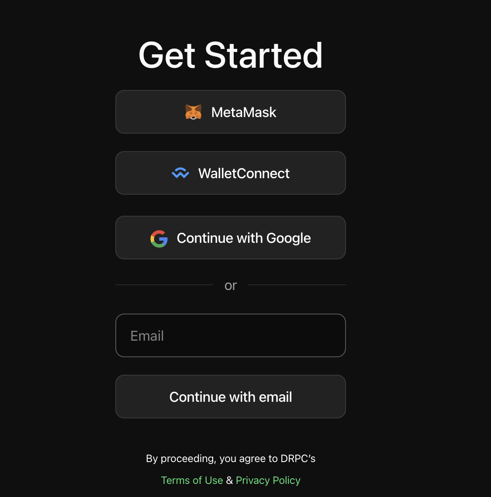

import Demo from "../../components/demo/demo.tsx";

# Create DRPC key

### 1. Log into or create your account

Go to [drpc.org/login](https://drpc.org/login).
You can login via your crypto wallet (we support Metamask and Wallet Connect).
Or you can login via email and password.

### 2. Create new key

DRPC keys are used to differentiate between different applications or parts of an application.
You can set a daily limit for each key, and deactivate it if you suspect that it has been compromised.
Additionally, you can view request statistics for each key, which can help you track usage
and optimize your application's performance.

<Demo src="https://demo.arcade.software/GNuAdoqi5Z4QnsZcDukQ?embed" />

### 3. Create custom endpoint or use the default one

Endpoints are not like keys. Each key can have any number of endpoints.

**In fact, endpoints are basically URLs consisting of**

- Base DRPC URL address
- Set key parameter
- Other URL parameters that define different settings/features for you requests to DRPC

By default there is always one endpoint with default DRPC settings. You can select network and protocol for it.
This endpoint should be enough for most projects.

However, if you need something special you can create custom endpoint.
Custom enpdoint allows you to specify different settings like:

- Select the list of specific providers if you want only them to serve your requests
- Enable fallback in case those specific providers fail, we will rereoute request to available providers
- Enable DRPC verification, etc

<Demo src="https://demo.arcade.software/yryuplArhsjGzAJ1ep6a?embed" />
