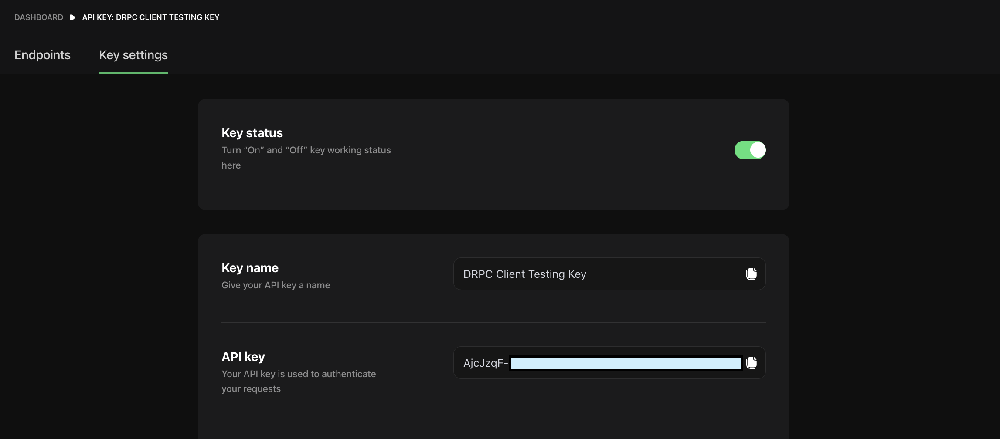

import { Tab, Tabs } from "nextra-theme-docs";

# First request to DRPC

First, [get your endpoint](./createaccount.mdx).

### Authentication

Each endpoint on UI by default contains your authentication key as a URL parameter `dkey` and network as `network`.

For example, `ethereum` network of DRPC will look like this:
`https://lb.drpc.org/ogrpc?network=ethereum&dkey=YOUR-DRPC-KEY`.

Another recommended way for authentication is to use special HTTP header `Drpc-Key`.

The following are examples of how to make a requests:

<Tabs items={['curl', 'curl + header', 'HTTP', 'HTTP + header']}>
<Tab>
```bash copy
curl -X POST -H 'Content-Type: application/json' \
-d '{"method": "eth_blockNumber","params": [],"id": "1","jsonrpc": "2.0"}' \
'https://lb.drpc.org/ogrpc?network=ethereum&dkey=YOUR-DRPC-KEY'
```
</Tab>
<Tab>
```bash copy
curl -X POST -H 'Content-Type: application/json' -H 'Drpc-Key: YOUR-DRPC-KEY' \
-d '{"method": "eth_blockNumber","params": [],"id": "1","jsonrpc": "2.0"}' \
'https://lb.drpc.org/ogrpc?network=ethereum'
```
</Tab>

<Tab>
```http copy
POST https://lb.drpc.org/ogrpc?network=ethereum&dkey=YOUR-DRPC-KEY
content-type: application/json

{"method": "eth_blockNumber","params": [], "id": "1", "jsonrpc": "2.0"}

````
</Tab>
<Tab>
```http copy
POST https://lb.drpc.org/ogrpc?network=ethereum
content-type: application/json
Drpc-Key: YOUR-DRPC-KEY

{"method": "eth_blockNumber","params": [], "id": "1", "jsonrpc": "2.0"}

````

</Tab>

</Tabs>

DRPC key value is the part of your endpoint by default. Also, you can find it on the `Key -> Settings` page:


### Making requests from code

DRPC conforms to standard JSON RPC protocol, that most of the blockchains use today.
So, you can use any standard library for you preferred language to make request, for example:

<Tabs items={['JavaScript']}>
<Tab>

```js copy
let Web3 = require("web3");
let provider = "https://lb.drpc.org/ogrpc?network=ethereum&dkey=YOUR-DRPC-KEY";
let web3Provider = new Web3.providers.HttpProvider(provider);
let web3 = new Web3(web3Provider);

// Get the latest block number
web3.eth.getBlockNumber().then((result) => {
  console.log("Latest Ethereum Block is ", result);
});
```

</Tab>
</Tabs>

## DRPC SDK

However, there is also DRPC SDK, which supports DRPC protocol, it's an alternative protocol
for calling blockchain methods which allows us to do additional things like response verification,
provider response signatures client check, etc.

Currently, there is only JS version of this library.

1. To install run:

`npm install @drpcorg/drpc-sdk`

2. You can use typescript to customize your endpoint without UI.
   We also support providers for ethere.js and web3.js, for example:

```ts copy
import { DrpcProvider } from "drpc-sdk/dist/esm/providers/ethers";
// for cjs
// import { DrpcProvider } from 'drpc-sdk/dist/cjs/providers/ethers';

async function getBlock(tag) {
  let provider = new DrpcProvider({
    dkey: "YOUR-API-KEY",
    provider_ids: ["public"],
  });
  let block = await provider.getBlock(tag);
}
```

3. You can check the complete docs for our SDK here: [https://p2p-org.github.io/drpc-client/](https://p2p-org.github.io/drpc-client/)
