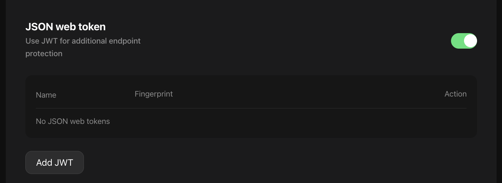
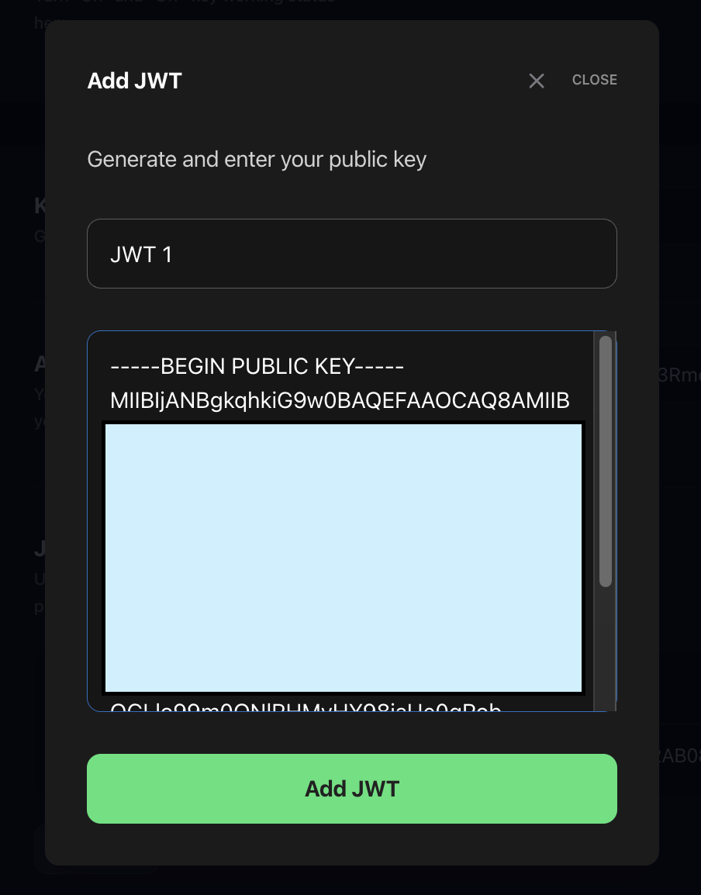
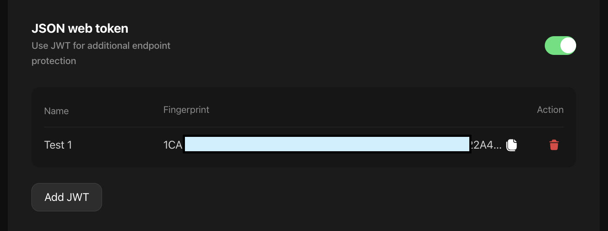

import { Tabs, Tab, Callout } from "nextra-theme-docs";

# JWT Authentication

When you're **Paid Tier** DRPC user and have enabled `JSON web token` in your key settings, JWTs are used as additional layer of security to authenticate your requests.

## How to use JWTs

### Step 1: Generate Public/Private Key Pair

- A private and public key pair can be generated using a tool such as [OpenSSL](https://www.openssl.org).
- DRPC supports [RS256](https://datatracker.ietf.org/doc/html/rfc7518#section-3.3) and [ES256](https://datatracker.ietf.org/doc/html/rfc7518#section-3.4) cryptographic algorithms.

```bash copy
## RS256
openssl genrsa -out private.pem 2048
openssl rsa -in private.pem -outform PEM -pubout -out public.pembas
```

```bash copy
## ES256
openssl ecparam -name prime256v1 -genkey -noout -out private.pem
openssl ec -in private.pem -pubout -out public.pembash
```

- Generate a fingerprint of your public key for verification

<Callout type={"warning"}>Make sure your private key stays private</Callout>

### Step 2: Configure JWT in the DRPC dashboard

1). **Enable JWT in your key settings**:

- Log into the DRPC dashboard.
- Navigate to the Key settings page and enable `JSON web token` section.



2). **Upload Public Key**:

- Upload your public key.



3). **Verify Fingerprint**:

- DRPC generates a Fingerprint for the public key.
- Ensure this Fingerprint matches the one from your public key, confirming the key's integrity and authenticity.



### Step 3: Set Up JWT Authentication Server

- Implement a server (e.g., using Express.js) to generate JWTs using the private key and provide clients with an endpoint to fetch JWTs.
- If you want to rate limit your jwt, you should add the 'limitCUPerMinute' claim to the payload of your token and specify how many CUs per minute you want to limit

<Tabs items={['Node.js']}>
<Tab>
```js copy
const fs = require("fs");
const jwt = require("jsonwebtoken");

// The fingerprint/id value of the public key that was uploaded to DRPC
const KEY_ID = "79B3987D5-EXAMPLE-FINGERPRINT-ID";

function generateJWT() {
// Read the private key from our 'private.pem' file
const privateKey = fs.readFileSync("../private.pem");

    const signOptions = {
        algorithm: "RS256", // DRPC supports RS256 and ES256
        expiresIn: "30d", // When the token will expire? ( 30 days from now )
        header: {
            kid: KEY_ID,
        },
    };

    const payload = {
        limitCUPerMinute: 200000, // add this claim to payload if you want to rate limit your jwt; this is CUs per minute
    };

    const GENERATED_JWT = jwt.sign(payload, privateKey, signOptions);

    // Log the newly created JWT
    console.log(GENERATED_JWT);

}

// Generate and log
generateJWT();

````

</Tab>
</Tabs>

### Step 4: Client Application Integration

- **Fetch and store JWT**:
  Modify your client application to request a JWT from your server and store it for API requests to DRPC.

### Step 5: Authenticate Requests to DRPC

- **Include JWT in API Requests**:
  Use the fetched JWT in the **`Authorization`** header for secure communication with DRPC.


<Tabs items={['curl', 'HTTP']}>
<Tab>
```bash copy
curl -X POST -H 'Content-Type: application/json' -H 'Drpc-Key: YOUR-DRPC-KEY' \
-H 'Authorization: GENERATED_JWT' \
-d '{"method": "eth_blockNumber","params": [],"id": "1","jsonrpc": "2.0"}' \
'https://lb.drpc.org/ogrpc?network=ethereum'
````

</Tab>

<Tab>
```http copy
POST https://lb.drpc.org/ogrpc?network=ethereum
content-type: application/json
Drpc-Key: YOUR-DRPC-KEY
Authorization: GENERATED_JWT

{"method": "eth_blockNumber","params": [], "id": "1", "jsonrpc": "2.0"}

```

</Tab>


</Tabs>

### Step 6: DRPC verifies JWT

DRPC validates the JWT in each request using the public key that user has uploaded.

