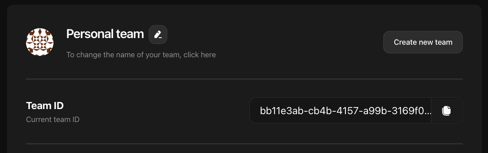
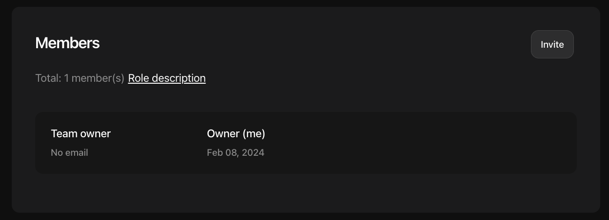

import { Meta } from "../../components/Meta";

<Meta />

# Teams and roles

## Teams

When you first log in and your user record is created, so does your initial team.
At first, you are the only member of this team, and you are the team **owner**.
You can send invitation for other members to their email addresses.
If needed, new team can be created using modal form on your current team page.
Currently we have a limitation of **5 teams per user**.

## Roles and members

Apart from **owner** role there are others: **admin, viewer, and treasurer**.
You can find team's members list on the bottom of the team page.
It is possible to transfer your team ownership to another team member, however your initial team is not transferable.

### Roles description

The following is table of descriptions for roles.

| Role                                                             |  Owner  |             Admin             | Viewer  | Treasurer |
| :--------------------------------------------------------------- | :-----: | :---------------------------: | :-----: | :-------: |
| Can create API keys                                              | **Yes** |            **Yes**            |   No    |    No     |
| Can create teams                                                 | **Yes** |              No               |   No    |    No     |
| Can rename teams                                                 | **Yes** |              No               |   No    |    No     |
| Has access to Statistics API token generation                    | **Yes** |              No               |   No    |    No     |
| Can set warning/critical levels for team's balance notifications | **Yes** |              No               |   No    |    No     |
| Can invite new members to the team                               | **Yes** |              No               |   No    |    No     |
| Can manage member roles in team                                  | **Yes** | Only for viewer and treasurer |   No    |    No     |
| Can manage member team invitations                               | **Yes** |              No               |   No    |    No     |
| Can manage view setting page                                     | **Yes** |            **Yes**            |   No    |    No     |
| Can manage view key endpoints page                               | **Yes** |            **Yes**            | **Yes** |    No     |
| Can manage view team statistics page                             | **Yes** |            **Yes**            | **Yes** |    No     |
