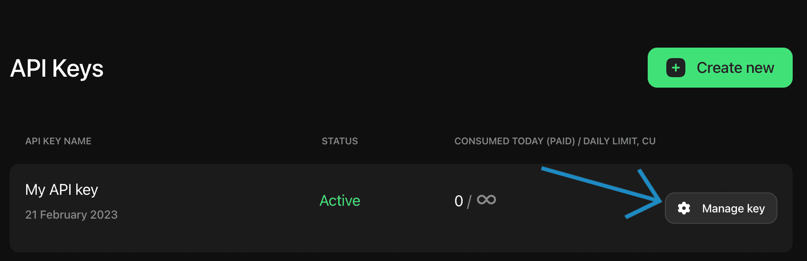
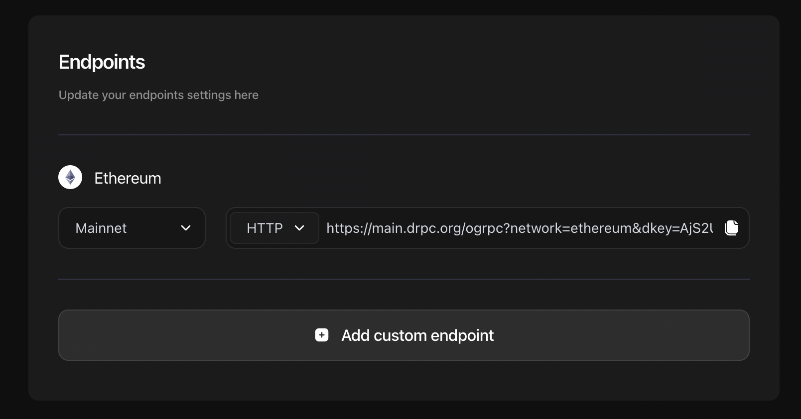

import { Tab, Tabs, Callout } from "nextra-theme-docs";

# Verification

If you decide to enable verification, then DRPC consensus protocol will perform several steps:

1. Verify that responses are equal by comparing the result data.
2. Check the signature of the response by comparing it with the public key of the provider.

## Custom Endpoint UI

On the DRPC Dashboard you can create Custom Endpoints. These endpoints will be your own API endpoints that you can use to call your providers.
Click on `Manage key` button to proceed.

Then you can create your custom endpoint by clicking on `Add custom endpoint` button.

When creating Custom Endpoint in DRPC Dashboard you can set the `quorum_of` and `quorum_from` params.

- `quorum_from` is the total amount of responses that you want to receive from the providers.
- `quorum_of` is the amount of **equal responses** that you want to receive from the providers to consider the response as valid.

<Callout type="warning">
  Since we want `quorum_of` to be more that half of total responses,
  [DRPC-SDK](https://github.com/p2p-org/drpc-client) will throw an error if
  `quorum_of` is less than `quorum_from / 2`.
</Callout>

`Verification URL` is the URL that you can use to verify the response from the provider. It's necessary for verification to work.
There are several options for this URL:

1. You can use the default one: `https://main.drpc.org/verification`
2. You can integrate your own [DRPC-SDK](https://github.com/p2p-org/drpc-client) server and use it's URL to perform verification.
3. Or you can deploy your own [DRPC-Sidecar](https://github.com/p2p-org/drpc-sidecar) and use it as a verification server.

## DRPC-Sidecar

[DRPC-Sidecar](https://github.com/p2p-org/drpc-sidecar) is the package and server that makes DRPC look like simple JSON RPC provider

It accepts URL params and passes them to DRPC-SDK client. Then it returns the response from DRPC-SDK client.

DRPC sidecar looks and works like any other JSON RPC provider.
Its responsibility to provide compatibility with software that doesn't support DRPC natively, however want to use all the good stuff.

Configurable settings are described in [DRPC SDK documentation](https://p2p-org.github.io/drpc-client/modules.html#ProviderSettings)

## Configuring DRPC-SDK client

<Callout type="info">
  If you only pass one param (`quorum_of` or `quorum_from`), the other one will
  be automatically **set to the same value**. On the other hand, if you pass
  **NO quorum_of and NO quorum_from**, the default value for both of them is
  `1`.
</Callout>

<Callout type="warning">
  Please also note that `quorum_from`, the total amount of responses for the API
  call should be `less or equal to` the total amount of providers passed to API
  config. Otherwise, API calls will fail.
</Callout>

## Consensus scheme

In the example below, we have 3 providers and 2 equal responses to achieve consensus.

