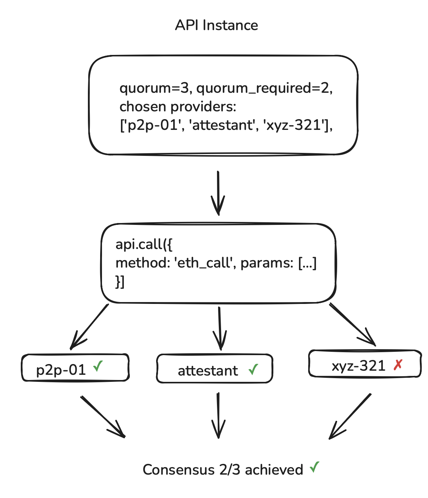
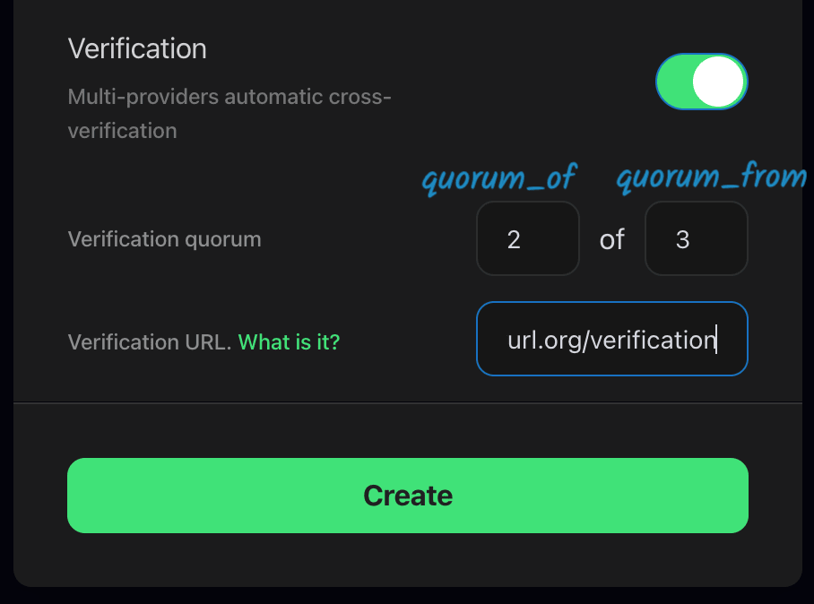
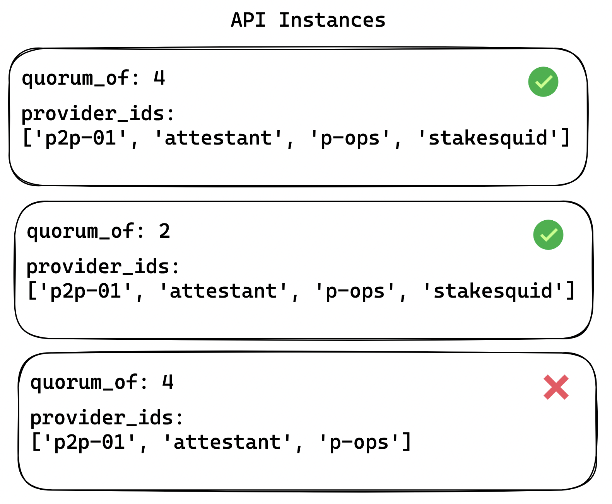
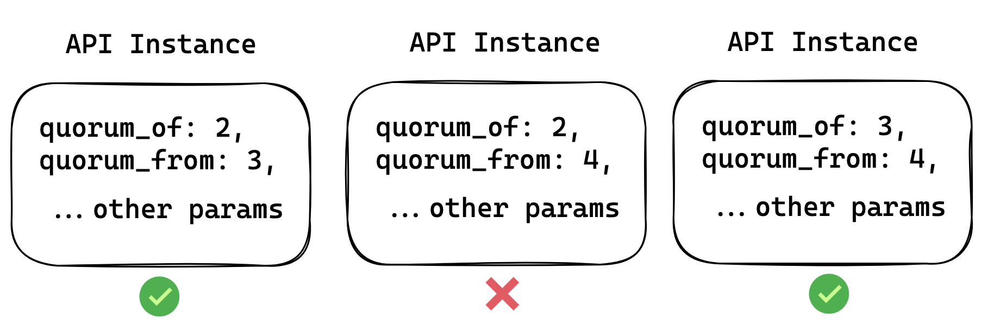

import { Tab, Tabs, Callout } from "nextra-theme-docs";

# Verification

## Why use verification?

Sometimes you have an important requests and you want to make sure that the response is correct.
If so, you can use DRPC verification feature to achieve consensus between your providers.

In this case we will send your request to several providers and wait for their responses.
Then we will compare the responses and if they are equal, we will return the response to you.

For verification DRPC will perform several steps:

1. Send the request to the providers.
2. Check the signature of the response by comparing it using the public key of the provider.
3. Verify that responses are equal by comparing the result data.

<Callout type="info">
  Total amount of responses that you want to receive from the providers is
  called `quorum_from`. Amount of **equal responses** that you want to receive
  from the providers to consider the response as valid is called `quorum_of`.
</Callout>

The example above shows that DRPC has received 3 responses from the providers, and 2 of them are equal (considering signature checking and result data checking).

## JSON RPC protocol

JSON RPC protocol is a protocol that allows you to make requests to a server and receive a response. It's a very popular protocol that is used by many different services.

In our case it's used to reach out for Ethereum and other blockchains, and ultimately is basis for many different services.

However JSON RPC protocol does not allow a verification of the response on client-side. That's also one of the reasons why we have created a special protocol that allows you to use DRPC verification feature with any JSON RPC provider.

## DRPC protocol

DRPC protocol is similar to JSON RPC protocol. It's built on top of JSON RPC protocol and compatible with it via tools like `DRPC-SDK` and `DRPC-Sidecar`, which are described below.

## DRPC-SDK

[DRPC-SDK](https://github.com/p2p-org/drpc-client) is a client library that allows you to use DRPC verification feature with any JSON RPC provider.

Configurable settings are described in [DRPC SDK documentation](https://p2p-org.github.io/drpc-client/modules.html#ProviderSettings)

## DRPC-Sidecar

Since standard JSON RPC protocol does not allow a verification of the response, we have created a special package that allows you to use DRPC verification feature with any JSON RPC provider ([DRPC-Sidecar](https://github.com/p2p-org/drpc-sidecar)).

It accepts URL params and passes them to DRPC-SDK client. Then it returns the response from DRPC-SDK client.

It's responsibility to provide compatibility with software that doesn't support DRPC natively, however want to use all the good stuff.

## DRPC Dashboard - Custom Endpoint UI

When creating Custom Endpoint in **DRPC Dashboard** you can set the `quorum_of` and `quorum_from` params.

Below we will explore how can you set up verification when creating **Custom Endpoint** in **DRPC Dashboard**, which are the options for `Verification URL` used there and how can you configure **DRPC-SDK** client.

<Callout type="warning">
  We want `quorum_of` to be **more** that half of total responses (`quorum_from
  / 2`).
</Callout>

`Verification URL` is the URL that you can use to verify the response from the provider. It's necessary for verification to work.

There are several options:

1. You can use the default one: `https://main.drpc.org/verification`
2. You can integrate [DRPC-SDK](https://github.com/p2p-org/drpc-client) into your application (if that's an option) and use it to perform verification. In this case all the configuration will be done on the side of DRPC-SDK.
3. Or you can deploy your own [DRPC-Sidecar](https://github.com/p2p-org/drpc-sidecar) and use it as a verification server.

## Configuring DRPC-SDK client

<Callout type="info">
  If you only pass one param (`quorum_of` or `quorum_from`), the other one will
  be automatically **set to the same value**. On the other hand, if you pass
  **NO quorum_of and NO quorum_from**, the default value for both of them is
  `1`.
</Callout>

<Callout type="warning">
  As said previously, `quorum_from`, the total amount of responses for the API
  call should be `less or equal to` the total amount of providers passed to API
  config. Otherwise, API calls will fail.
</Callout>

