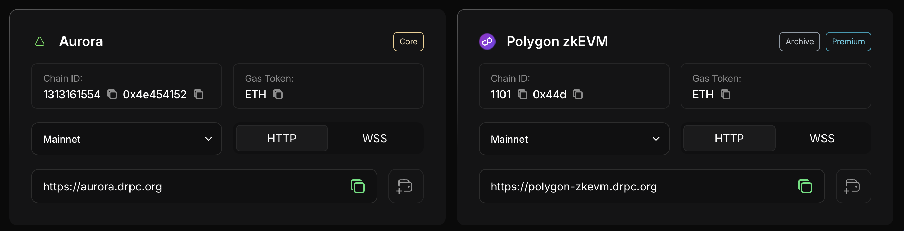

import { Meta } from "../../components/Meta";

<Meta
  title="What Are Archive Nodes? Why Full Blockchain History Matters"
  description="Learn how archive nodes differ from full/light ones and why they’re vital for historical blockchain data access."
/>

# Archive Nodes: Why They Matter

Public blockchains operate as vast peer-to-peer networks of interconnected computers. Each device, referred to as a node, plays a role in storing blockchain data, processing transactions, and verifying the state of the network. \
Not all nodes are created equal; they serve different purposes based on their design and capabilities. Among these, archive nodes stand out for their ability to store the complete historical data of a blockchain. Full nodes maintain only the most recent states, light nodes rely on full nodes for data requests, archive nodes provide comprehensive access to the entire history of the network.

## Archive Nodes in EVM
An EVM archive node is a type of full node that retains the entire history of the blockchain, including the genesis block—the very first block ever created. Full and light nodes serve distinct purposes, archive nodes offer an unmatched ability to retrieve historical data.

 **Full Nodes** \
Full nodes store the current blockchain state along with the most recent 128 blocks. They handle tasks like validating new blocks, executing smart contracts, and processing transactions. Full nodes aren’t designed for intensive archival queries. \
**Light Nodes (Light Clients)** \
Light clients store only block headers, which provide minimal blockchain information such as timestamps and hashes. They depend on full nodes for additional data and require minimal resources, making them ideal for users with limited hardware. \
**Archive Nodes** \
Archive nodes, in contrast, store all the data of full nodes alongside the complete historical states of the blockchain. They require significant hardware investment but are invaluable for retrieving historical snapshots, such as account balances at specific block heights.

## dRPC Archive nodes

On most popular networks, dRPC provides archive nodes with full historical data. You can check if a network has archive nodes either in [chainlist](https://drpc.org/chainlist) or directly in the dashboard when selecting a network for your API key. If a network is labeled “Archive”, it means there is at least one archive node available. If the label is not present, only full nodes (without archive data) are available. \

**Important**: archive support can be nuanced depending on the network. The “Archive” label does not always guarantee full history from block 0. If you have any doubts, feel free to reach out via our [Support Portal](https://support.drpc.org/).