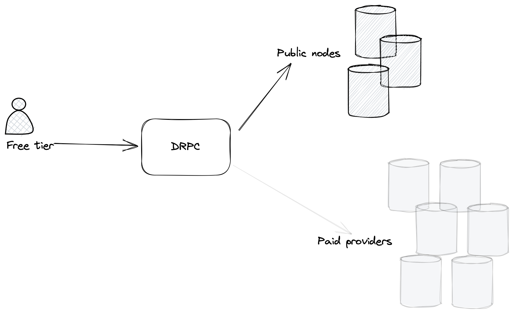
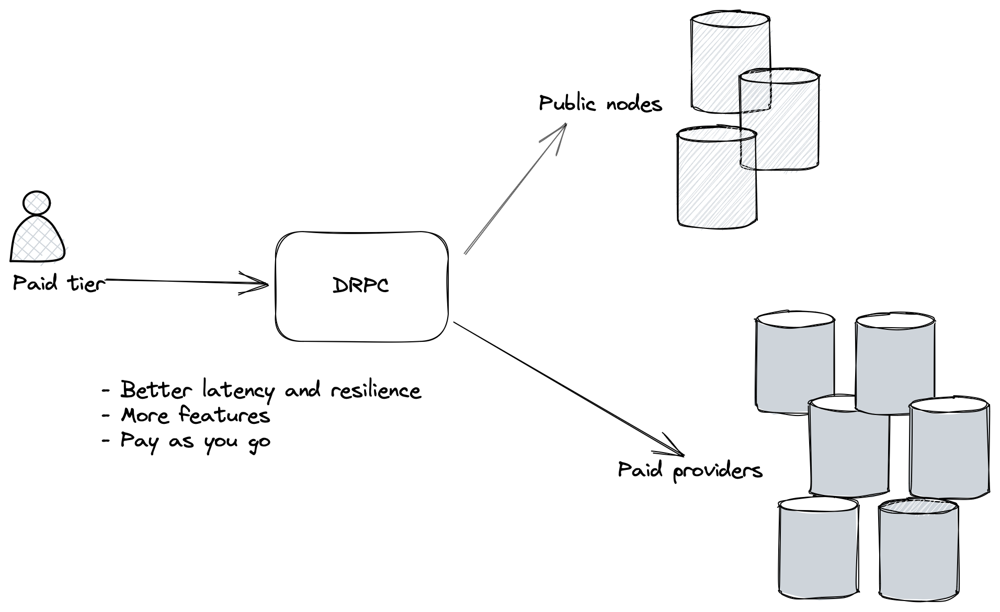

# Free vs paid requests

DRPC has two tiers: a free tier and a paid tier. The free tier allows for an unlimited amount of requests, but only over public nodes, which can be less reliable and slower. However, the load balancing over multiple public nodes still makes it better than connecting to a single public node.

The paid tier allows users to connect to all providers and offers additional features, such as load balancing fallback and verification. These features are not available in the free tier.

The paid tier is based on a pay-as-you-go strategy where users deposit money into their account and DRPC charges them per request. Each request have its own cost in compute units (CUs), you can see the exact values [here](./compute-units).

